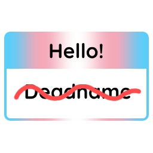
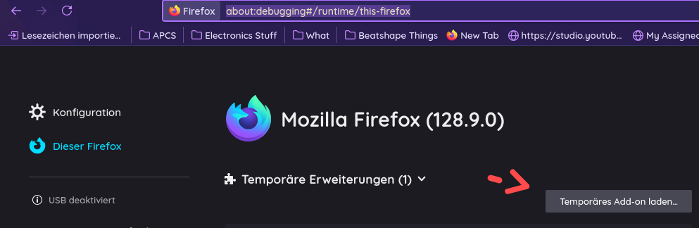

  

## Deadnameify - Remove Deadnames Effortlessly

Deadnameify is a Firefox Add-on designed to replace deadnames with your preferred name across websites.

## Table Of Contents:
- **Features**
- **Requirements**
- **Setup**
- **License**

## Features:
- Replace deadnames with preferred names dynamically across websites.
- Case-sensitive replacement options (for certain deadnames/flexibility)
- User-friendly interface for managing deadnames and preferred names.
- (Soon) Light and dark themes :3

## Requirements:
**To build/use this extension, you'll need the following:**
- **A little bit of HRT** - Just know how to use JS :3
- **Firefox** - Sorry Chrome people, Manifest V3 is a pain in the butt.. 

## Setup:
1. Clone the repository / download the zip
    - if you don't know how to clone a repo, install [git](https://git-scm.com/downloads)/[gh](https://cli.github.com/) (id recommend git) and use `git clone https://github.com/mochaisher/deadnameify.git` (or gh if you installed it)
2. Add the Add-on via `about:debugging#/runtime/this-firefox`, click "Add temporary Add-on, it should look like this:
    - 
2. Configure your deadnames and preferred names via the Add-on!!

## License:
Deadnameify is licensed under the [**GNU General Public License v1.0+**](./LICENSE).

happy pride month :3 🏳️‍⚧️